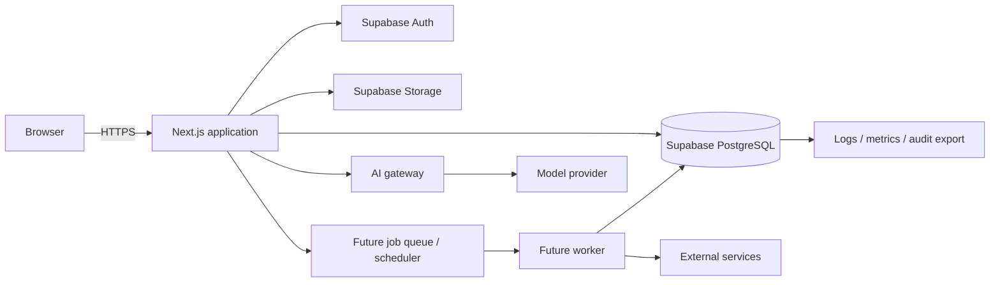
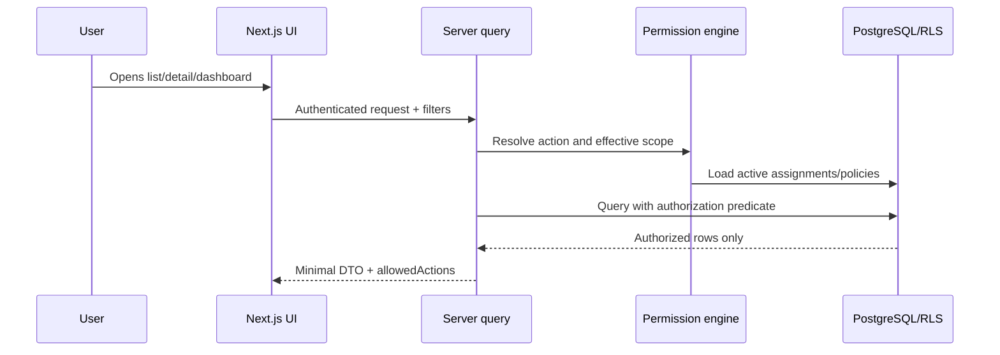

# Architecture

## Execution Core implementation note

The modular monolith now contains Decisions, Tasks, PDCA, shared execution, collaboration and file-access modules. Domain creation and state transitions use transactional PostgreSQL functions because a security object, scopes, aggregate row, history, audit and outbox-ready facts must succeed or fail together. Server Components use the authenticated Supabase client so RLS remains active; Server Actions are transport adapters over application services/RPCs.

No Meetings, AI provider, external-notification adapter or analytics materialization was introduced.

## 1. Status and intent

This document defines the proposed target architecture before implementation. It is subordinate to `CONTEXT.md` and should be updated through explicit architectural decisions when implementation reveals new constraints.

The product is a multi-company execution management platform for meetings, decisions, PDCAs, tasks, projects, follow-up and management insight. The architecture optimizes for deterministic authorization, traceability, incremental delivery and continued operation when optional integrations, including AI, are unavailable.

## 2. Architectural style

Use a **modular monolith** deployed as one Next.js application with one PostgreSQL database managed by Supabase.

Each domain module owns:

- its domain types and invariants;
- application services/use cases;
- repository interfaces and query builders;
- authorization calls, without reimplementing authorization rules;
- events it emits and consumes;
- tests and public module API.

Modules share infrastructure only through explicit platform services: identity, authorization, scope, audit, files, notifications, search, analytics and AI gateway. Direct cross-module table access is permitted only inside reviewed read models; transactional writes cross module boundaries through application services.

This keeps deployment simple while preserving boundaries that could later support extraction if justified by scale or ownership.

## 3. Runtime topology



The initial direction is a Vercel-compatible Next.js application with Supabase/PostgreSQL. Initial deployment does not require a separate worker. Transactional application code writes durable outbox records; lightweight post-commit processing can initially run through scheduled/server jobs. A dedicated worker is introduced only when delivery guarantees, latency or volume require it.

## 4. Frontend

Use Next.js App Router, React, TypeScript strict mode, Tailwind CSS and shadcn/ui as a component foundation.

### Client-side responsibilities

- render already-authorized data;
- manage local interaction state, optimistic feedback and form state;
- perform accessibility behavior, responsive layouts and reduced-motion preferences;
- request server-side mutations and invalidate/refetch queries;
- show capability hints supplied by the server, such as `allowedActions`;
- support real-time collaboration where useful, without treating the client as authoritative.

The client must not calculate effective permissions, query broad datasets and filter them locally, generate trusted audit events, sign attachment URLs, call a model provider directly, or hold Supabase service-role credentials.

Server Components are preferred for initial protected reads and page composition. Client Components are used where interaction, browser APIs, live collaboration or optimistic updates justify them. TanStack Query may manage highly interactive operational data, but is not mandatory for static/server-rendered views.

## 5. Backend and application layer

The Next.js server runtime hosts the modular monolith. Server Actions or Route Handlers are transport adapters, not locations for domain logic.

Every protected use case follows this sequence:

1. obtain the authenticated actor from the server session;
2. validate input against a narrow command/query schema;
3. invoke the centralized authorization service;
4. load or mutate only records within the effective scope;
5. enforce domain invariants in an application service;
6. commit business changes, audit events and outbox events atomically where possible;
7. return the minimum required representation and allowed actions.

Server-side responsibilities include authorization, domain transitions, scope resolution, transaction orchestration, export generation, attachment access, analytics filtering, AI context assembly and integration secrets.

## 6. Database and Supabase

PostgreSQL is the system of record. Supabase provides managed PostgreSQL, Auth and Storage. The relational model stores business entities, many-to-many scope relationships, temporal assignments and immutable audit facts. JSONB is limited to flexible metadata, validated event payloads, AI payloads and provider-specific configuration.

### Database-side responsibilities

- foreign keys, uniqueness, check constraints and referential integrity;
- tenant/company isolation primitives;
- Row Level Security as defense in depth;
- normalized scope and membership relations;
- atomic audit/outbox persistence;
- recursive/closure-assisted hierarchy resolution;
- safe SQL views or functions for repeated permission primitives;
- deterministic aggregate calculations where SQL is the appropriate layer.

RLS must not become a second, divergent permission engine. It should call a small stable set of security-definer functions or membership predicates that mirror the application authorization contract and are tested with the same fixtures. The application remains responsible for action-level and workflow authorization.

## 7. Authentication and identity

Supabase Auth owns credentials and authentication sessions. `auth.users` is mapped one-to-one to an application `profiles` record. Business identity, employment state, display data and assignments live in application tables, not auth metadata.

Protected requests use server-validated sessions. Deactivated profiles are denied even if an Auth session remains valid. High-risk administration should support stronger controls later, including MFA policy, recent-authentication checks and session revocation.

## 8. Authorization

Authorization is a shared infrastructure module. Effective access combines:

- functional permissions obtained through active role assignments;
- company and organizational-unit scope;
- service/department scope;
- direct and inherited restaurant scope;
- object scope;
- visibility policy;
- explicit grants or explicit administrative capabilities;
- workflow state and relationship constraints for the requested action.

The canonical API is conceptually:

- `getAccessibleScope(actor, action?, objectType?)`;
- `can(actor, action, object)`;
- `filterAccessibleObjects(actor, query)`.

List queries must embed authorization predicates before pagination, aggregation or full-text search. Object lookups return not-found semantics where appropriate to avoid existence disclosure. Full rules are specified in `permissions.md`.

## 9. Domain modules and boundaries

| Module        | Owns                                                          | May depend on                               |
| ------------- | ------------------------------------------------------------- | ------------------------------------------- |
| Identity      | profiles, activation state                                    | Auth adapter, audit                         |
| Organization  | companies, units, restaurants, assignments, hierarchy         | identity, audit                             |
| Authorization | roles, permissions, policies, grants, scope resolution        | identity, organization, audit               |
| Meetings      | series, sessions, participants, agenda, notes, review/publish | authorization, execution public APIs, audit |
| Decisions     | decisions and their traceability links                        | authorization, scope, audit                 |
| PDCA          | PDCA lifecycle, phases, KPI/result, closure                   | tasks public API, authorization, audit      |
| Tasks         | task lifecycle, assignments, blockers, dependencies           | authorization, audit                        |
| Projects      | initiatives and related-object membership                     | authorization, audit                        |
| Collaboration | comments, collaborators, watchers                             | authorization, notifications, audit         |
| Files         | attachment metadata and controlled storage access             | authorization, audit                        |
| Notifications | preferences, inbox, delivery/outbox                           | authorization, integrations                 |
| Search        | permission-aware indexes and result projection                | module read APIs, authorization             |
| Analytics     | deterministic metric definitions and read models              | authorization, domain read models           |
| AI            | context assembly, model gateway, proposals and provenance     | authorization, analytics, module tools      |
| Audit         | immutable event append/query                                  | identity, authorization                     |

Cross-domain relationships use typed association tables only where the relationship is genuinely polymorphic, such as comments and audit subject references. Core business relationships such as PDCA-to-task and session-to-decision remain explicit foreign keys or join tables.

## 10. Data flow

### Protected read



### Protected mutation

Commands use optimistic concurrency (`version` or `updated_at`) for conflict-prone records. In one transaction they validate current state, authorize against the persisted object, apply transition, write domain-specific history/audit and append outbox events. Notifications and integrations consume outbox events after commit.

## 11. Audit logging

Audit is append-only. Important mutations record actor, effective identity, action, subject, company, timestamp, request correlation, old/new values or a minimized change set, and an optional reason. Audit records are not editable through normal application paths.

Business history with queryable semantics remains in dedicated tables when needed, for example due-date history and assignment validity. Audit events complement rather than replace those tables.

Sensitive payloads must be minimized and may require field-level redaction. Reading audit data is itself permission-controlled. Database triggers may provide a last-line record for critical administrative tables; application services provide richer business intent.

## 12. Notifications and events

Use a transactional outbox table to decouple business transactions from delivery. Domain modules emit facts such as `task.assigned`, `pdca.blocked` and `meeting.published`. Notification policy translates facts into user inbox entries according to preferences and access at delivery time.

Initial scope: in-app notifications with read/unread state. Future adapters: email, Teams, WhatsApp and push. A notification must never contain protected details the recipient can no longer access; rendering/opening rechecks authorization.

## 13. Analytics

Analytics are deterministic read models built from canonical timestamps and history tables. Authorization filters the fact population before aggregation. Start with ordinary indexed SQL queries and views; introduce materialized views only for stable, expensive aggregates after measurement. Any pre-aggregated data must retain sufficient scope dimensions to apply authorization safely or be generated per authorized cohort.

AI interprets, summarizes and links these metrics but does not calculate authoritative KPI values.

## 14. AI layer

AI is an optional server-side adapter behind an internal gateway. It receives only an authorized, minimized and structured context. Model output is validated against schemas and treated as a proposal. High-impact actions require review and explicit confirmation through the normal domain service, which re-authorizes at execution time.

The application remains fully usable when the AI provider times out, is disabled or is unavailable. No core state transition depends solely on model output.

## 15. External integrations

Future integrations use adapters behind stable ports and consume outbox events. Provider identifiers and state are kept outside core entities in integration tables. Inbound webhooks are signature-verified, idempotent and mapped to explicit commands. Outbound calls use retries with backoff, idempotency keys, dead-letter handling and observability.

Do not add an integration platform or message broker until concrete requirements justify it.

## 16. Future background/async jobs

Candidates include:

- notification delivery and digest generation;
- recurring meeting-session generation;
- deadline and stale-item detection;
- search indexing;
- attachment scanning and document extraction;
- materialized-view refresh;
- AI extraction and executive brief generation;
- external synchronization and webhook retries.

Jobs must operate under a declared system capability and explicit company/scope, never as an unconstrained service role. Each job is idempotent, observable and records failures without partially applying domain changes.

## 17. Administrative workflow

Administration is a protected domain workflow, not direct table editing. An authorized administrator proposes a change to a company, unit, restaurant, role, permission policy, organizational assignment or hierarchy relationship. The server validates referential consistency, the administrator's functional permission and full affected scope, temporal overlaps, cycles and delegation limits.

Before a high-impact change, the UI presents the effective-access delta: people and scopes gaining or losing access, active objects whose Owner/Responsible may become inaccessible, and any sessions/jobs affected. Global or sensitive permission changes may require a second approver. Confirmation applies the configuration and temporal history, audit event, authorization-version invalidation and outbox notifications in one transaction.

Deactivation is preferred to deletion. Transfers end the former assignment and create a new one; they do not rewrite history. Bulk operations use the same per-target validation and produce a reviewed summary before execution. No administrator changes production organization or permissions through raw client-side Supabase writes.

## 18. Initial directory proposal

```text
src/
  app/                         # routes, layouts, server entry points
  modules/
    identity/
    organization/
    authorization/
    meetings/
    decisions/
    pdca/
    tasks/
    projects/
    collaboration/
    files/
    notifications/
    search/
    analytics/
    ai/
    audit/
  platform/
    auth/                      # Supabase Auth adapter
    database/                  # client factories, transaction support
    storage/                   # controlled Storage adapter
    events/                    # outbox and dispatcher
    observability/
    integrations/
  shared/
    contracts/                 # cross-module value types only
    validation/
    time/
  ui/
    components/
    patterns/
    styles/
supabase/
  migrations/
  seed/
  tests/                       # SQL/RLS tests
tests/
  authorization/
  integration/
  e2e/
docs/
```

Inside a module, prefer `domain/`, `application/`, `infrastructure/` and `presentation/` only when the module is large enough to benefit. Avoid empty architectural ceremony in small modules.

## 19. Deployment and observability

Use separate development, staging and production Supabase projects. Migrations are versioned and applied through CI/CD. Structured logs use correlation IDs and avoid secrets or protected payloads. Monitor authorization denials, elevated administrative actions, job failures, AI/tool failures, export volume and suspicious attachment access.

Backups, point-in-time recovery and restore exercises are production requirements, not substitutes for business audit history.

## 20. Open Architectural Decisions

No deployment decision blocks the approved foundation: target Vercel-compatible Next.js, Supabase/PostgreSQL and a transactional outbox, without a dedicated worker. Provider/account/region selection remains an operational deployment decision.

## 21. Implementation status — Execution hardening and Meetings

The modular-monolith boundary is now concrete for `meetings`: routes and server actions orchestrate an application module, while PostgreSQL commands own transactional invariants and reuse the normal Decision, Task and PDCA commands. Meeting creation never contains a second, simplified execution path.

Authenticated browser traffic uses the user's Supabase session. Lists and details query RLS-filtered views/tables; mutations use narrowly granted `SECURITY DEFINER` commands that recover the actor from JWT claims, re-authorize the action and validate full proposed scope. Meeting mode stores agenda, notes and object links as independent rows with their own versions, rather than a shared document blob.

Attachment upload is server mediated: authorize parent, validate configured MIME/size/count, upload to private Storage, register metadata/audit, and delete the stored object if metadata registration fails. Download re-authorizes the parent and issues a short-lived signed URL. This is the accepted cross-system compensation boundary until malware quarantine/scanning is introduced.

Playwright is now part of the test foundation. Its local configuration waits for the Supabase REST schema to be ready, starts Next.js on an isolated port and exercises real password sessions against development-only identities. Local self-sign-up support exists only in `supabase/config.toml`; production must continue to use invitation/admin provisioning policy.
