# Data Model

## Execution Core implementation note

The implemented schema uses explicit domain tables for `decisions`, `tasks` and `pdcas`. Shared concerns are limited to `object_memberships` (Collaborator/Watcher), `comments` and `attachments`, all with a real FK to `security_objects`.

Core relationships use domain FKs: `tasks.pdca_id`, `tasks.originating_decision_id`, `pdcas.originating_decision_id`, `decision_task_links`, `decision_pdca_links`, `task_dependencies` and typed `pdca_dependencies`. No unconstrained `(object_type, object_id)` relationship table was introduced.

Implementation-specific history tables are:

- Task/PDCA status transitions;
- PDCA phase transitions;
- Task/PDCA due-date changes;
- Task/PDCA completion and reopening events;
- Task/PDCA blocker intervals.

List views expose normalized scope IDs alongside domain list fields and execute as `security_invoker`, so RLS filters the population before search, filters, counts and pagination.

Lifecycle codes and Decision statuses are stored in lookup tables. Priority, impact and risk remain separate domain dimensions but currently reuse one `severity_definitions` scale; labels, weights, ordering and activation are configurable while codes used by workflow rules remain stable. Separate per-dimension catalogues can be introduced later only if their scales genuinely diverge.

## 1. Modelling principles

The initial model is relational, normalized and designed for PostgreSQL/Supabase. It separates organizational configuration, authorization, collaboration and execution history.

Key decisions:

- `profiles` extends Supabase `auth.users`; authentication data is not duplicated.
- `organizational_units` is a common organizational supertype. `departments` and `shared_services` are subtype tables, keeping their semantics distinct without duplicating common fields.
- `restaurants` remain a separate operational-scope dimension. A restaurant can reference a company and can participate in hierarchy/assignment relations without pretending to be a department.
- Every protected business record has one `security_objects` row. Normalized scope, explicit grants, collaborators, watchers, comments and attachments reference that row with real FKs.
- Core links remain explicit: tasks use `pdca_id`, decisions retain origin, and meeting/object recurrence uses a dedicated link table.
- Business history that drives metrics has dedicated tables. `audit_events` is not the only source for deadline or blocker calculations.
- All timestamps use `timestamptz` in UTC. Business dates use `date` where time-of-day is irrelevant.
- Mutable aggregate roots use `version bigint` for optimistic concurrency.

Unless noted otherwise, tables include `created_at`, `updated_at` and `created_by_profile_id`. IDs are UUIDs generated by the database. Human-readable reference numbers are separate and may be allocated per company.

## 2. Type strategy

### PostgreSQL enums

Use enums only for stable technical invariants:

- `visibility_mode`: `NORMAL`, `RESTRICTED`, `PRIVATE`;
- `grant_effect`: initially `ALLOW` only; explicit deny is deferred to avoid conflict complexity;
- `membership_kind`: `OWNER`, `RESPONSIBLE`, `COLLABORATOR`, `WATCHER`;
- `scope_dimension`: only if needed by event payloads, not for relational scope storage.

Lifecycle statuses, priorities, impact, risk, meeting types and notification types are configurable lookup tables, not PostgreSQL enums.

### JSONB

Use JSONB for validated, non-core flexibility:

- audit change payloads;
- integration/provider metadata;
- AI request/response metadata and structured proposal payloads;
- notification rendering parameters;
- optional meeting-note rich-text document representation;
- attachment extraction metadata.

Do not store core scope, assignments, dependencies, permissions, current owners or restaurant relations in JSONB.

## 3. Identity and organization

### `companies`

- **Purpose:** legal/operating organization and top-level isolation boundary.
- **Fields:** `id`, `name`, `legal_name`, `code`, `timezone`, `locale`, `is_active`, `deactivated_at`.
- **PK/FKs:** PK `id`; no parent FK initially.
- **Constraints:** `code` unique case-insensitively; deactivation timestamp consistent with `is_active`.
- **Lifecycle:** deactivate, never delete when referenced.
- **Indexes:** unique normalized `code`; `(is_active)` partial index.

### `profiles`

- **Purpose:** application identity and employment/application state.
- **Fields:** `id`, `auth_user_id`, `display_name`, `email_snapshot`, `preferred_locale`, `timezone`, `is_active`, `deactivated_at`, `last_seen_at`.
- **PK/FKs:** PK `id`; unique FK `auth_user_id -> auth.users.id`.
- **Constraints:** one profile per auth identity; display name required.
- **Lifecycle:** deactivate; retain attribution history.
- **Indexes:** unique `auth_user_id`; normalized display name/email for admin search.

### `organizational_units`

- **Purpose:** common identity for departments and transversal shared services.
- **Fields:** `id`, `company_id`, `unit_type`, `name`, `code`, `is_active`, `active_from`, `active_to`, `metadata`.
- **PK/FKs:** PK `id`; FK `company_id -> companies`.
- **Constraints:** `unit_type` lookup/check limited initially to `DEPARTMENT`, `SHARED_SERVICE`; unique `(company_id, normalized code)`; valid date range.
- **Lifecycle:** temporal activation/deactivation.
- **Indexes:** `(company_id, unit_type, is_active)`, normalized name.

### `departments`

- **Purpose:** marks an organizational unit as an internal department and stores department-specific configuration.
- **Fields:** `organizational_unit_id`, optional `parent_department_id`, operational metadata.
- **PK/FKs:** PK/FK `organizational_unit_id -> organizational_units`; self-FK `parent_department_id`.
- **Constraints:** base unit must have `unit_type=DEPARTMENT`, enforced through service/trigger or subtype design validation.
- **Lifecycle:** follows base unit.
- **Indexes:** `parent_department_id`.

### `shared_services`

- **Purpose:** marks an organizational unit as a transversal service without placing it below an internal department.
- **Fields:** `organizational_unit_id`, optional `provider_company_id`, service configuration.
- **PK/FKs:** PK/FK to `organizational_units`; FK `provider_company_id -> companies`.
- **Constraints:** base unit must have `unit_type=SHARED_SERVICE`.
- **Lifecycle:** follows base unit.
- **Indexes:** `provider_company_id`.

### `restaurants`

- **Purpose:** configurable operational unit and independent authorization dimension.
- **Fields:** `id`, `company_id`, `name`, `code`, `timezone`, `address`, `opened_on`, `closed_on`, `is_active`, `metadata`.
- **PK/FKs:** PK `id`; FK `company_id -> companies`.
- **Constraints:** unique `(company_id, normalized code)`; valid operating date range.
- **Lifecycle:** close/deactivate rather than delete.
- **Indexes:** `(company_id, is_active)`, normalized name.

## 4. Roles, permissions and organizational placement

### `roles`

- **Purpose:** configurable bundles of functional permissions.
- **Fields:** `id`, optional `company_id` (`NULL` for platform template), `name`, `code`, `description`, `is_active`.
- **PK/FKs:** PK; optional FK company.
- **Constraints:** unique normalized code within company/template namespace.
- **Lifecycle:** deactivate; assignments remain historical.
- **Indexes:** `(company_id, is_active)`.

### `permissions`

- **Purpose:** atomic stable capabilities.
- **Fields:** `id`, `key` (`resource.action`), `description`, `risk_level`, `is_delegable`, `is_active`.
- **PK/FKs:** PK.
- **Constraints:** globally unique immutable `key`.
- **Lifecycle:** deactivate only after compatibility review.
- **Indexes:** unique `key`.

### `role_permissions`

- **Purpose:** many-to-many role capability mapping.
- **Fields:** `role_id`, `permission_id`, optional policy flags such as `delegable` constrained by permission.
- **PK/FKs:** composite PK and FKs to roles/permissions.
- **Constraints:** no duplicates.
- **Lifecycle:** changes audited; optional validity can be added if policy history must be queryable beyond audit.
- **Indexes:** reverse index on `permission_id`.

### `organizational_assignments`

- **Purpose:** temporal placement of a person in a company/unit with a role and scope-policy configuration.
- **Fields:** `id`, `profile_id`, `company_id`, optional `organizational_unit_id`, `role_id`, `unit_scope_mode`, `restaurant_scope_mode`, `valid_from`, `valid_to`, `is_active`, `title`, `metadata`.
- **PK/FKs:** FKs to profile, company, optional unit and role.
- **Constraints:** referenced unit and role must belong to/be usable in the company; valid time range; prohibit exact overlapping duplicates.
- **Lifecycle:** end-date/deactivate, never overwrite historical placement.
- **Indexes:** `(profile_id, is_active, valid_from, valid_to)`, `(company_id, organizational_unit_id)`, `role_id`.

`unit_scope_mode` is constrained to `ASSIGNED` or `COMPANY_WIDE`. `restaurant_scope_mode` is constrained to `NONE`, `ASSIGNED`, `INHERITED` or `COMPANY_WIDE`. These independent dimensions support transversal departments (`ASSIGNED` unit + `COMPANY_WIDE` restaurants), operations (`COMPANY_WIDE` units + assigned/inherited restaurants) and global access without granting functional permissions through scope configuration.

### `hierarchy_relationships`

- **Purpose:** temporal directed reporting/responsibility edges between organizational assignments.
- **Fields:** `id`, `parent_assignment_id`, `child_assignment_id`, `relationship_type`, `valid_from`, `valid_to`, `is_active`.
- **PK/FKs:** both assignments FKs.
- **Constraints:** parent != child; same-company unless explicitly supported; no active duplicate; cycle prevention on write.
- **Lifecycle:** end-date edges.
- **Indexes:** active parent and child indexes; range index if temporal queries demand it.

Use an **adjacency list as source of truth** because branches are configurable and history matters.

### `hierarchy_closure_current`

- **Purpose:** derived current transitive closure for fast inherited-scope resolution.
- **Fields:** `ancestor_assignment_id`, `descendant_assignment_id`, `depth`, `refreshed_at`.
- **PK/FKs:** composite PK; FKs to assignments.
- **Constraints:** one shortest/current path row; self rows at depth 0.
- **Lifecycle:** derived/rebuildable; historical hierarchy comes from adjacency date ranges.
- **Indexes:** reverse descendant index.

This closure table is introduced only if recursive CTE performance is insufficient in realistic tests. It is not authoritative.

### `restaurant_assignments`

- **Purpose:** direct restaurant coverage for an organizational assignment.
- **Fields:** `id`, `organizational_assignment_id`, `restaurant_id`, `responsibility_type`, `valid_from`, `valid_to`, `is_active`.
- **PK/FKs:** assignment and restaurant FKs.
- **Constraints:** same company; no exact active duplicate; valid dates.
- **Lifecycle:** temporal end-date.
- **Indexes:** active assignment-to-restaurant and restaurant-to-assignment indexes.

## 5. Shared security and scope model

### `security_objects`

- **Purpose:** FK-backed registry for every protected aggregate, enabling common scope/grants/collaboration without unvalidated polymorphic IDs.
- **Fields:** `id`, `company_id`, `object_type`, `visibility`, `created_by_profile_id`, `archived_at`, `version`, timestamps.
- **PK/FKs:** PK; FKs to company/profile.
- **Constraints:** immutable `object_type`; exactly one matching domain aggregate; registry and aggregate created in one transaction.
- **Lifecycle:** archive with aggregate; normally never hard-delete.
- **Indexes:** `(company_id, object_type, visibility)`, creator, active partial index.

Each protected aggregate (`meeting_series`, `meeting_sessions`, `decisions`, `pdcas`, `tasks`, `projects`) has a unique `security_object_id` FK. A deferred integrity check or disciplined service plus tests guarantees one-to-one type correctness.

### `object_scope_organizational_units`

- **Purpose:** many-to-many department/shared-service scope.
- **Fields/keys:** `security_object_id`, `organizational_unit_id`; composite PK and FKs.
- **Constraints:** same company.
- **Indexes:** reverse unit index plus security object PK order.

### `object_scope_restaurants`

- **Purpose:** many-to-many restaurant scope.
- **Fields/keys:** `security_object_id`, `restaurant_id`; composite PK and FKs.
- **Constraints:** same company.
- **Indexes:** reverse restaurant index.

### `object_scope_companies`

- **Purpose:** supports exceptional multi-company objects while `security_objects.company_id` remains the owning/audit company.
- **Fields/keys:** `security_object_id`, `company_id`; composite PK/FKs.
- **Constraints:** at least owning company; cross-company creation requires special permission.
- **Indexes:** reverse company index.

Do not add generic people scope: explicit grants and object memberships express person-specific relationships with clearer semantics.

### `explicit_access_grants`

- **Purpose:** bounded temporal access to one security object.
- **Fields:** `id`, `security_object_id`, `grantee_profile_id`, `permission_id`, `granted_by_profile_id`, `reason`, `valid_from`, `valid_to`, `revoked_at`, `revoked_by_profile_id`, `source_type`.
- **PK/FKs:** FKs to object, profiles and permission.
- **Constraints:** grantor delegation authority; valid interval; active uniqueness for same object/grantee/permission/source.
- **Lifecycle:** revoke/end-date, never delete.
- **Indexes:** active grants by grantee; grants by object; expiry index.

## 6. Configurable classifications

### `status_definitions`

- **Purpose:** company/object-type-specific configurable lifecycle labels while code works with stable semantic categories.
- **Fields:** `id`, `company_id`, `object_type`, `code`, `label`, `semantic_category`, `is_terminal`, `sort_order`, `is_active`.
- **Constraints:** unique company/object/code; semantic categories are stable constrained values used by analytics.
- **Indexes:** `(company_id, object_type, is_active)`.

### `priority_definitions`, `impact_definitions`, `risk_definitions`

- **Purpose:** configurable labels/order mapped to stable numeric severity weights.
- **Fields:** `id`, `company_id`, `code`, `label`, `weight`, `is_active`.
- **Constraints:** unique code per company; bounded weight.
- **Indexes:** company/active.

### `meeting_types`

- **Purpose:** configurable meeting categories and default workflow settings.
- **Fields:** `id`, `company_id`, `code`, `label`, `default_visibility`, `is_active`.
- **Indexes/constraints:** unique company/code; company/active.

Lookup values are deactivated rather than deleted. Historical records continue referencing them.

## 7. Meetings and decisions

### `meeting_series`

- **Purpose:** recurring or conceptual meeting definition.
- **Fields:** `id`, `security_object_id`, `title`, `description`, `meeting_type_id`, `chair_profile_id`, recurrence configuration, `default_duration_minutes`, `is_active`, `ended_at`, `version`.
- **PK/FKs:** PK; unique security object FK; FKs to type/chair.
- **Constraints:** recurrence rule validated; chair eligibility checked by service.
- **Lifecycle:** deactivate/end series.
- **Indexes:** chair, active, next occurrence if stored.

Recurrence configuration may use a standards-based text field (for example iCalendar RRULE) plus explicit timezone, not an unstructured JSON schedule.

### `meeting_sessions`

- **Purpose:** one occurrence/shared meeting workspace.
- **Fields:** `id`, `security_object_id`, optional `series_id`, `title`, `scheduled_start_at`, `scheduled_end_at`, `actual_start_at`, `actual_end_at`, `chair_profile_id`, `status_id`, `published_at`, `closed_at`, `reopened_at`, `version`.
- **PK/FKs:** unique security object; optional series; chair/status.
- **Constraints:** time ordering; published/closed timestamps consistent with state.
- **Lifecycle:** archive only after closure; reopening creates history.
- **Indexes:** series/date, chair/date, status/date.

### `meeting_participants`

- **Purpose:** invited/attending people and session-specific participation rights.
- **Fields:** `id`, `session_id`, `profile_id`, `participant_role`, `invitation_status`, `attendance_status`, `joined_at`, `left_at`, optional `access_grant_id`.
- **PK/FKs:** session/profile plus optional explicit grant.
- **Constraints:** unique session/profile; chair represented consistently.
- **Lifecycle:** participant history retained; removal revokes future access according to policy.
- **Indexes:** profile/upcoming sessions, session/role.

### `meeting_agenda_items`

- **Purpose:** ordered subjects planned or discussed.
- **Fields:** `id`, `session_id`, optional `carried_from_agenda_item_id`, `title`, `description`, `position`, `status`, `presenter_profile_id`, `planned_minutes`, `started_at`, `completed_at`, `postponed_reason`.
- **PK/FKs:** session, self-reference, presenter.
- **Constraints:** unique position per session; no carry-forward cycle.
- **Lifecycle:** retained after session; postponed items link forward rather than duplicate history invisibly.
- **Indexes:** session/position, carried-from.

### `meeting_notes`

- **Purpose:** attributed session or agenda notes.
- **Fields:** `id`, `session_id`, optional `agenda_item_id`, `author_profile_id`, `content_text`, optional `content_document jsonb`, `note_type`, `is_private_draft`, `version`.
- **PK/FKs:** session, agenda item, author.
- **Constraints:** agenda item belongs to session; content size limits.
- **Lifecycle:** edits versioned/audited; deletion becomes redaction/archive where policy permits.
- **Indexes:** session/agenda/date, author/date; full-text index on authorized note search if required.

### `decisions`

- **Purpose:** first-class decision with durable context.
- **Fields:** `id`, `security_object_id`, `reference_no`, `title`, `description`, optional `originating_session_id`, optional `originating_agenda_item_id`, `decision_date`, `decided_by_profile_id`, optional `project_id`, `status_id`, `published_at`, `version`.
- **PK/FKs:** unique security object; session/agenda/profile/project/status FKs.
- **Constraints:** agenda/session consistency; company-scoped reference unique.
- **Lifecycle:** archive/cancel rather than erase.
- **Indexes:** origin session, project, decision date, status.

### `meeting_subject_links`

- **Purpose:** relate any meeting session/agenda item to existing decisions, PDCAs, tasks or projects without duplication.
- **Fields:** `id`, `session_id`, optional `agenda_item_id`, `security_object_id`, `link_type` (`ORIGINATED`, `DISCUSSED`, `REVIEWED`, `CARRIED_FORWARD`), `added_by_profile_id`.
- **Constraints:** unique meaningful combination; linked object company/scope validated; do not use for session itself.
- **Indexes:** object-to-session history, session/agenda.

## 8. Execution entities

### `projects`

- **Purpose:** initiative that groups meetings, decisions, PDCAs, tasks and documents.
- **Fields:** `id`, `security_object_id`, `reference_no`, `title`, `description`, `status_id`, `owner_profile_id`, `responsible_profile_id`, `start_date`, `target_end_date`, `completed_at`, `progress_method`, optional manual progress, `version`.
- **Constraints:** date ordering; progress bounds; relationships require access.
- **Lifecycle:** complete/cancel/archive; reopening recorded.
- **Indexes:** status/dates, owner, responsible.

### `pdcas`

- **Purpose:** structured improvement/problem-solving aggregate distinct from tasks.
- **Fields:** `id`, `security_object_id`, `reference_no`, `title`, `problem_statement`, `objective`, `root_cause_hypothesis`, `plan_summary`, `do_summary`, `check_summary`, `act_summary`, `phase`, `status_id`, `priority_id`, `impact_id`, `risk_id`, `owner_profile_id`, `responsible_profile_id`, optional `project_id`, optional `originating_session_id`, `start_date`, `due_date`, `first_action_at`, `completed_at`, `closed_at`, `expected_result`, `actual_result`, `completion_notes`, `closure_requires_owner_approval`, `closure_approved_by`, `closure_approved_at`, `reopened_at`, `version`.
- **Constraints:** company-scoped reference; owner/responsible eligibility; timestamp consistency; approval fields consistent.
- **Lifecycle:** full transition and reopening history; archive only after terminal state.
- **Indexes:** status/due date, owner, responsible, project, origin session, priority/impact/risk, stale (`last_activity_at` maintained on aggregate or read model).

### `pdca_kpis`

- **Purpose:** one or more measurable PDCA indicators.
- **Fields:** `id`, `pdca_id`, `name`, `unit`, `baseline_value`, `target_value`, `actual_value`, `measurement_method`, `measured_at`.
- **Constraints:** unit/value compatibility handled through validated numeric/text representation; target is not mandatory during early Plan.
- **Lifecycle:** changes audited; measurements may move to `pdca_kpi_measurements` if repeated time series is required.
- **Indexes:** `pdca_id`.

### `tasks`

- **Purpose:** independently executable action.
- **Fields:** `id`, `security_object_id`, `reference_no`, `title`, `description`, `status_id`, `priority_id`, `owner_profile_id`, `responsible_profile_id`, optional `pdca_id`, optional `project_id`, optional `originating_session_id`, optional `originating_decision_id`, `start_date`, `due_date`, `first_action_at`, `completed_at`, `completion_notes`, `reopened_at`, `version`.
- **Constraints:** date/state consistency; cross-links belong to compatible company; reference unique per company.
- **Lifecycle:** transition/reopen/archive with history.
- **Indexes:** status/due, owner, responsible, PDCA, project, origins, stale activity.

### `object_memberships`

- **Purpose:** common owner/responsible/collaborator/watcher relation history for securable objects.
- **Fields:** `id`, `security_object_id`, `profile_id`, `membership_kind`, `valid_from`, `valid_to`, `is_active`, `assigned_by_profile_id`.
- **Constraints:** one active membership per kind/profile/object; exactly one active OWNER and RESPONSIBLE where domain policy requires them.
- **Lifecycle:** temporal, never overwrite history.
- **Indexes:** active work by profile/kind; members by object.

`pdcas.owner_profile_id` and similar columns are denormalized current pointers for integrity/query ergonomics and must be updated transactionally with membership history. Alternatively they may be omitted after performance/complexity validation. `collaborators` and `watchers` are represented by filtered `object_memberships`, avoiding duplicate tables with identical structure.

### `execution_dependencies`

- **Purpose:** directed dependency between task/PDCA/decision security objects or an external dependency.
- **Fields:** `id`, `dependent_object_id`, optional `prerequisite_object_id`, `dependency_type`, optional `external_description`, `status`, `created_by_profile_id`, `resolved_at`.
- **Constraints:** no self-dependency; exactly one internal prerequisite or external description; supported object types; cycle detection for blocking internal edges.
- **Lifecycle:** resolve/cancel, retain history.
- **Indexes:** dependent unresolved, prerequisite unresolved.

### `blockers`

- **Purpose:** measurable blocking interval and reason.
- **Fields:** `id`, `security_object_id`, `reason`, optional `blocking_object_id`, optional `blocked_by_profile_id`, `blocked_at`, `resolved_at`, `resolved_by_profile_id`, `resolution_notes`.
- **Constraints:** target type task/PDCA initially; resolved time after blocked time; one or multiple concurrent blockers allowed by explicit policy.
- **Lifecycle:** close interval, never delete.
- **Indexes:** active blockers by object, `blocked_at`, blocking object.

### `due_date_changes`

- **Purpose:** authoritative deadline history and extension analytics.
- **Fields:** `id`, `security_object_id`, `old_due_date`, `new_due_date`, `change_type`, `reason`, `requested_by_profile_id`, `approved_by_profile_id`, `changed_at`.
- **Constraints:** supported object type; values differ; approval required for configured extension flow.
- **Lifecycle:** immutable.
- **Indexes:** object/date, changed date, change type.

### `status_transitions`

- **Purpose:** queryable lifecycle history.
- **Fields:** `id`, `security_object_id`, `from_status_id`, `to_status_id`, `actor_profile_id`, `reason`, `transitioned_at`.
- **Constraints:** statuses valid for object type; transition allowed by workflow configuration.
- **Lifecycle:** immutable.
- **Indexes:** object/date, status/date.

### `completion_events` and `reopening_events`

- **Purpose:** preserve completion/closure and reopening facts needed for rates and repeated cycles.
- **Fields:** event ID, object ID, actor, timestamp, reason/notes, evidence state; completion includes due-date snapshot.
- **Constraints:** supported object type and workflow state.
- **Lifecycle:** immutable.
- **Indexes:** object/date and period aggregation.

## 9. Collaboration, files and notifications

### `comments`

- **Purpose:** threaded discussion on a protected object.
- **Fields:** `id`, `security_object_id`, `author_profile_id`, optional `parent_comment_id`, `body`, `edited_at`, `redacted_at`, `version`.
- **Constraints:** parent belongs to same object; bounded depth/size; author immutable.
- **Lifecycle:** redact rather than hard-delete; edit history may use `comment_revisions`.
- **Indexes:** object/date, author/date, parent.

### `attachments`

- **Purpose:** protected metadata for files stored in a private Supabase bucket.
- **Fields:** `id`, `security_object_id`, `uploaded_by_profile_id`, `storage_bucket`, `storage_path`, `original_filename`, `media_type`, `byte_size`, `checksum`, `scan_status`, `extraction_status`, `metadata`, `archived_at`.
- **Constraints:** unique storage path; size/type allowlists; path not user-controlled; object access required.
- **Lifecycle:** archive; physical retention/deletion by policy.
- **Indexes:** object/date, uploader, scan status, checksum.

### `notifications`

- **Purpose:** per-recipient in-app notification.
- **Fields:** `id`, `recipient_profile_id`, optional `security_object_id`, `notification_type`, `title`, `render_params jsonb`, `created_at`, `read_at`, `dismissed_at`, `deduplication_key`.
- **Constraints:** unique deduplication key where supplied; no protected body snapshot beyond minimum.
- **Lifecycle:** retention/archive policy.
- **Indexes:** recipient unread/date; object; dedup key.

### `notification_preferences`

- **Purpose:** user/channel/event preferences.
- **Fields:** profile, event type, channel, enabled, quiet-hours metadata.
- **PK/FKs:** composite profile/event/channel.
- **Indexes:** profile.

### `outbox_events`

- **Purpose:** durable post-commit delivery for notifications, jobs and integrations.
- **Fields:** `id`, `event_type`, `aggregate_object_id`, `payload jsonb`, `occurred_at`, `available_at`, `processed_at`, `attempt_count`, `last_error`, `idempotency_key`.
- **Constraints:** unique idempotency key; validated payload version.
- **Lifecycle:** immutable business envelope plus delivery status; retention after processing.
- **Indexes:** unprocessed/available partial index.

## 10. Audit and AI support

### `audit_events`

- **Purpose:** immutable security/business audit record.
- **Fields:** `id`, `company_id`, optional `security_object_id`, `subject_type`, `subject_id`, `action`, optional `actor_profile_id`, `actor_type`, `request_id`, `reason`, `before_data jsonb`, `after_data jsonb`, `metadata jsonb`, `occurred_at`, integrity/version fields.
- **Constraints:** append-only permissions; payload redaction rules; actor or declared system capability required.
- **Lifecycle:** immutable with retention according to legal/security policy.
- **Indexes:** company/time, object/time, actor/time, action/time, request ID.

`subject_type/subject_id` exists for administrative records that are not securable objects, such as role assignment changes. Validation happens through a constrained subject catalog or dedicated audit writer.

### `ai_runs`

- **Purpose:** operational/provenance log without making model output authoritative.
- **Fields:** `id`, `requested_by_profile_id`, `company_id`, `use_case`, `model_provider`, `model_name`, `prompt_template_version`, `authorization_snapshot_version`, `status`, token/cost/latency metadata, error category, timestamps.
- **Constraints:** no raw unrestricted datasets; retention/redaction policy.
- **Indexes:** requester/time, use case/status/time.

### `ai_run_sources`

- **Purpose:** provenance links to records actually supplied to a model.
- **Fields:** `ai_run_id`, `security_object_id`, `source_version`, `context_role`.
- **PK/FKs:** composite PK.
- **Indexes:** object-to-run.

### `ai_proposals`

- **Purpose:** schema-validated suggestions awaiting human review.
- **Fields:** `id`, `ai_run_id`, `proposal_type`, `payload jsonb`, `status`, `reviewed_by_profile_id`, `reviewed_at`, optional `executed_object_id`, `rejection_reason`.
- **Constraints:** payload validated per version; execution once only with idempotency key.
- **Indexes:** pending reviewer/use case, AI run.

## 11. ERD

The diagram focuses on principal relationships and omits history/lookups for readability.

```mermaid
erDiagram
    AUTH_USERS ||--|| PROFILES : maps_to
    COMPANIES ||--o{ ORGANIZATIONAL_UNITS : contains
    ORGANIZATIONAL_UNITS ||--o| DEPARTMENTS : subtype
    ORGANIZATIONAL_UNITS ||--o| SHARED_SERVICES : subtype
    COMPANIES ||--o{ RESTAURANTS : operates
    PROFILES ||--o{ ORGANIZATIONAL_ASSIGNMENTS : has
    ROLES ||--o{ ORGANIZATIONAL_ASSIGNMENTS : applies
    ROLES ||--o{ ROLE_PERMISSIONS : includes
    PERMISSIONS ||--o{ ROLE_PERMISSIONS : granted_by
    ORGANIZATIONAL_ASSIGNMENTS ||--o{ RESTAURANT_ASSIGNMENTS : covers
    RESTAURANTS ||--o{ RESTAURANT_ASSIGNMENTS : assigned
    ORGANIZATIONAL_ASSIGNMENTS ||--o{ HIERARCHY_RELATIONSHIPS : parent
    ORGANIZATIONAL_ASSIGNMENTS ||--o{ HIERARCHY_RELATIONSHIPS : child

    COMPANIES ||--o{ SECURITY_OBJECTS : owns
    SECURITY_OBJECTS ||--o{ OBJECT_SCOPE_UNITS : scoped_to
    ORGANIZATIONAL_UNITS ||--o{ OBJECT_SCOPE_UNITS : scopes
    SECURITY_OBJECTS ||--o{ OBJECT_SCOPE_RESTAURANTS : scoped_to
    RESTAURANTS ||--o{ OBJECT_SCOPE_RESTAURANTS : scopes
    SECURITY_OBJECTS ||--o{ EXPLICIT_ACCESS_GRANTS : grants
    PROFILES ||--o{ EXPLICIT_ACCESS_GRANTS : receives
    SECURITY_OBJECTS ||--o{ OBJECT_MEMBERSHIPS : has
    PROFILES ||--o{ OBJECT_MEMBERSHIPS : participates

    SECURITY_OBJECTS ||--|| MEETING_SERIES : protects
    SECURITY_OBJECTS ||--|| MEETING_SESSIONS : protects
    SECURITY_OBJECTS ||--|| DECISIONS : protects
    SECURITY_OBJECTS ||--|| PDCAS : protects
    SECURITY_OBJECTS ||--|| TASKS : protects
    SECURITY_OBJECTS ||--|| PROJECTS : protects

    MEETING_SERIES ||--o{ MEETING_SESSIONS : produces
    MEETING_SESSIONS ||--o{ MEETING_PARTICIPANTS : includes
    PROFILES ||--o{ MEETING_PARTICIPANTS : attends
    MEETING_SESSIONS ||--o{ MEETING_AGENDA_ITEMS : organizes
    MEETING_AGENDA_ITEMS ||--o{ MEETING_NOTES : contains
    MEETING_SESSIONS ||--o{ MEETING_OBJECT_LINKS : discusses
    SECURITY_OBJECTS ||--o{ MEETING_OBJECT_LINKS : appears_in

    PROJECTS ||--o{ PDCAS : groups
    PROJECTS ||--o{ TASKS : groups
    PDCAS ||--o{ TASKS : decomposes_to
    MEETING_SESSIONS ||--o{ DECISIONS : originates
    DECISIONS ||--o{ TASKS : generates

    SECURITY_OBJECTS ||--o{ BLOCKERS : blocked_by
    SECURITY_OBJECTS ||--o{ EXECUTION_DEPENDENCIES : depends
    SECURITY_OBJECTS ||--o{ COMMENTS : discussed_in
    SECURITY_OBJECTS ||--o{ ATTACHMENTS : holds
    SECURITY_OBJECTS ||--o{ AUDIT_EVENTS : audited
    SECURITY_OBJECTS ||--o{ NOTIFICATIONS : references
    AI_RUNS ||--o{ AI_RUN_SOURCES : grounded_by
    SECURITY_OBJECTS ||--o{ AI_RUN_SOURCES : source
    AI_RUNS ||--o{ AI_PROPOSALS : produces
```

## 12. Index and query principles

- Put `company_id` early in indexes for high-volume tenant-bound tables.
- Use partial indexes for active/unresolved/unread records.
- Index both directions of large join tables.
- Add GIN full-text indexes only to authorized searchable projections, not as a reason to bypass row filters.
- Measure before adding materialized views. Candidate views are current effective hierarchy, daily execution facts and period aggregates.
- Avoid offset pagination for large operational feeds; use stable keyset pagination.
- Analyze scope-query plans with realistic multi-scope fixtures before freezing the model.

## 13. Deletion and retention

Core organizational and execution records are deactivated, completed, cancelled or archived. Physical deletion is limited to legally approved retention workflows, failed uploads and disposable drafts with no published history. Foreign keys should usually use `RESTRICT`; `CASCADE` is reserved for true owned implementation details, not business history.

## 14. Open Architectural Decisions

| Question                                                       | Recommended option                                                                                        | Alternatives                                                   | Impact                                                                                            |
| -------------------------------------------------------------- | --------------------------------------------------------------------------------------------------------- | -------------------------------------------------------------- | ------------------------------------------------------------------------------------------------- |
| Current owner/responsible columns versus membership table only | Keep current FK pointers plus temporal membership history transactionally consistent                      | Membership rows only                                           | Pointers simplify constraints and queries; duplication requires disciplined transactional updates |
| Multi-company objects in MVP                                   | Model owning company now; keep `object_scope_companies` but disable cross-company creation until required | Full multi-company support immediately; single-company forever | Avoids premature cross-tenant complexity while preserving an extension point                      |
| Repeated KPI measurements                                      | Start with current values plus add measurement table when time-series requirements are confirmed          | Build full time-series model now                               | Reduces MVP scope but affects future trend analytics migration                                    |

## 15. Implemented Meetings schema

Migrations `202609030008_meetings_schema.sql` and `202609030009_meetings_commands.sql` implement strong `meeting_series` and `meeting_sessions` tables, each with a required 1:1 `security_object_id`. The implemented supporting tables are `meeting_series_participants`, `meeting_participants`, `meeting_agenda_items`, `meeting_notes`, `meeting_object_links`, `meeting_session_status_transitions`, `meeting_publications` and `meeting_reopening_events`.

`meeting_object_links` references a `security_objects.id` only for the genuinely transversal association. A trigger/helper restricts readable targets to Decision, Task and PDCA in this increment, while every target remains backed by its strong domain table. The unique active-link constraint prevents duplicate association of the same object to one session; the same object may be linked to many sessions.

Statuses and agenda statuses use lookup tables because lifecycle definitions may gain metadata without changing authorization labels. Participant and link relation types use small PostgreSQL enums. Recurrence metadata is deliberately minimal (`recurrence_rule` plus JSONB metadata) and does not attempt to model a calendar engine.

Publication keeps an immutable JSONB snapshot of the session, agenda and notes. JSONB is appropriate here because this is a historical rendering artifact, not the source of current domain truth. Current operational data remains normalized.

## 16. Implemented AI schema

- `ai_runs`: `company_id`, `requested_by_profile_id`, `use_case` (MEETING_ASSISTANT, MEETING_SUMMARY, EXECUTION_VALIDATOR), `target_security_object_id`, `target_version` (staleness check), `model_provider`, `model_name`, `prompt_template_version`, `status` (RUNNING, SUCCEEDED, FAILED), `error_category`, token/latency telemetry, `started_at`, `finished_at`.
- `ai_run_sources`: composite key (`ai_run_id`, `security_object_id`) with `source_version` and `context_role` (TARGET, AGENDA, NOTE, LINK, INPUT). The target is always recorded; other sources must be readable by the actor at recording time.
- `ai_proposals`: `proposal_type` (DECISION, TASK, PDCA, SUMMARY, FINDING), validated `payload` plus `payload_version`, `status` (PENDING, CONFIRMED, REJECTED), reviewer, `review_reason`, `confirmed_payload` (the human-edited version actually executed), `executed_record_type`/`executed_record_id` and optimistic `version`.

Deletion is prevented by trigger; audit actions `ai.run.started`, `ai.run.completed`, `ai.proposal.created`, `ai.proposal.confirmed` and `ai.proposal.rejected` appear in the meeting and execution activity views.

## Notifications (2026-09-03)

`notifications` (recipient, type, category, title, metadata, security object,
target, href, sensitive, dedupe key, source outbox event, created/read) and
`notification_preferences` (per profile). `audit_events` now feed
`outbox_events` through a trigger. Gate D adds `push_subscriptions` and
`notification_deliveries`. See `docs/notifications.md`.
