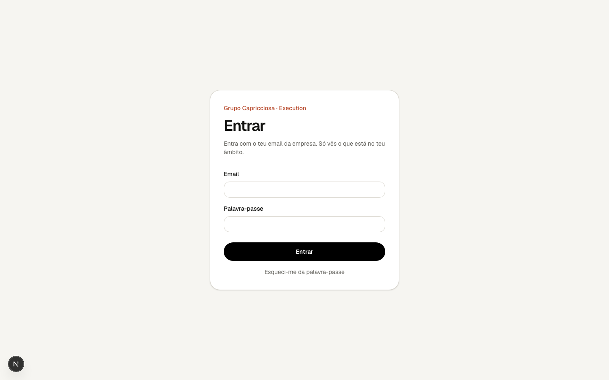

# 1. Primeiros passos

## Entrar

Abre a aplicação e entra com o teu email da empresa e a tua palavra-passe.

Se aparecer «Não foi possível iniciar sessão», confirma o email e a
palavra-passe. Se aparecer «O serviço de autenticação não respondeu», espera
uns segundos e tenta de novo; não é um problema das tuas credenciais.

## Primeiro acesso

Recebes um email «You have been invited» com um link. O link abre a aplicação
já com sessão iniciada e pede-te para definires uma palavra-passe (mínimo 10
caracteres). A partir daí entras sempre com email e palavra-passe. Se o link
tiver expirado, pede a quem gere a plataforma para reenviar o convite.

## Esqueci-me da palavra-passe

Na página de entrada carrega em **Esqueci-me da palavra-passe**, escreve o teu
email e carrega em **Enviar link**. Se esse email tiver conta, chega um email
com um link válido durante uma hora; abre-o e define a palavra-passe nova. A
resposta no ecrã é sempre a mesma, exista ou não a conta.

## O que vês depois de entrar

Cais em **O meu trabalho**, a página que resume o que precisa de ti hoje. A
barra lateral tem cinco entradas:

| Entrada        | Para quê                                                |
| -------------- | ------------------------------------------------------- |
| O meu trabalho | O que precisa da tua atenção, o que é teu, o que segues |
| Reuniões       | Marcar, entrar e terminar reuniões                      |
| PDCAs          | Problemas que se resolvem por fases                     |
| Tarefas        | Acções concretas com responsável e prazo                |
| Decisões       | O que ficou decidido e onde se aplica                   |

No fundo da barra vês o teu nome, a tua função e os restaurantes que cobres.

No telemóvel a barra lateral dá lugar a uma barra fina no topo (nome da
aplicação, sino das notificações e o teu avatar) e a uma barra de navegação no
fundo do ecrã com as mesmas cinco entradas. O avatar abre a tua função, os
restaurantes que cobres, **Definições** e **Terminar sessão**. Em «O meu
trabalho», o bloco escuro mostra só reuniões que precisam de ti; os itens
atrasados aparecem uma vez, na lista, marcados a vermelho.
Isso define o que consegues ver e fazer; não há nada para configurar.

## Vocabulário

- **Responsável**: quem executa. É obrigatório em tarefas e PDCAs.
- **Owner**: quem acompanha e garante que o assunto não fica esquecido.
  Obrigatório nos PDCAs, opcional nas tarefas. Nunca é preenchido às escondidas.
- **Onde se aplica**: os restaurantes (e a área) a que um assunto diz respeito.
  Quem cobre esses restaurantes passa a vê-lo.
- **Chair**: quem conduz a reunião e a termina.
