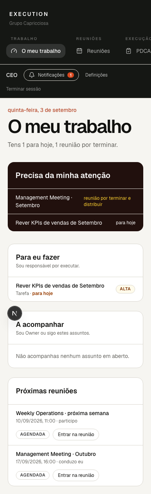
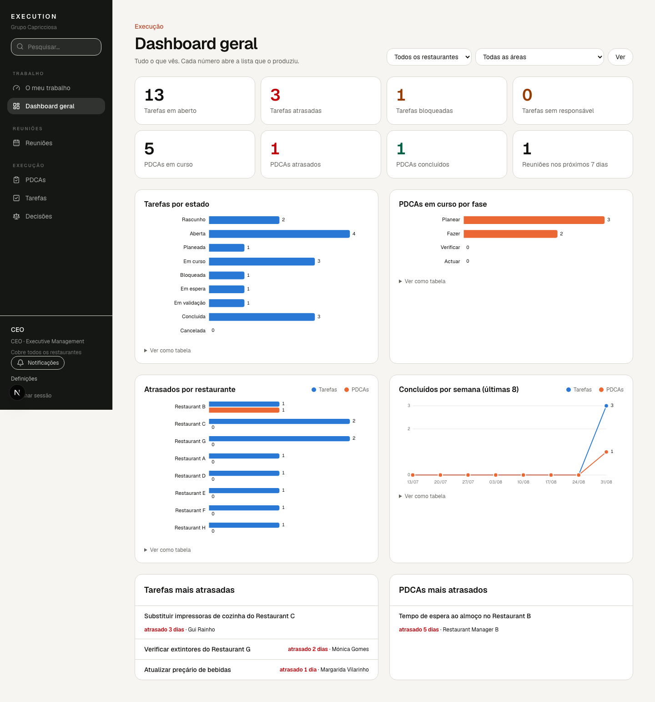

# 2. O meu trabalho

A página abre com uma frase que resume o teu dia («Tens 1 para hoje, 1 reunião
por terminar»). Depois tem quatro blocos:

1. **Precisa da minha atenção** — atrasados, bloqueados, para hoje e reuniões
   por terminar. Se estiver vazio, está tudo em ordem.
2. **Para eu fazer** — tudo o que executas (és Responsável). Ao lado de cada
   item aparece o prazo em linguagem simples («para hoje», «há 3 dias») e, em
   âmbar, o que falta («sem prazo», «sem Owner»).
3. **A acompanhar** — o que és Owner ou segues, sem ser tu a executar.
4. **Próximas reuniões** — as reuniões em que participas ou conduzes. Clica
   para entrar directamente na reunião.

Em telemóvel a página é a mesma, empilhada.

## Painel operacional

Em **Painel operacional** (barra lateral, ou o botão em «O meu trabalho» no
telemóvel) vês oito números: tarefas em aberto, atrasadas, bloqueadas e sem
responsável; PDCAs em curso, atrasados e concluídos; reuniões nos próximos 7
dias. Escolhe um restaurante ou uma área para restringir. Cada número é um
link para a lista com exactamente os filtros que o produziram, por isso o
total do cartão é sempre o número de linhas da lista. Por baixo, as cinco
tarefas e os cinco PDCAs mais atrasados.
