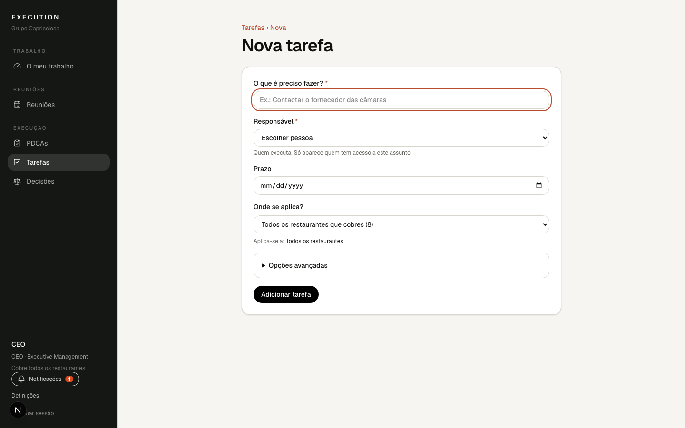
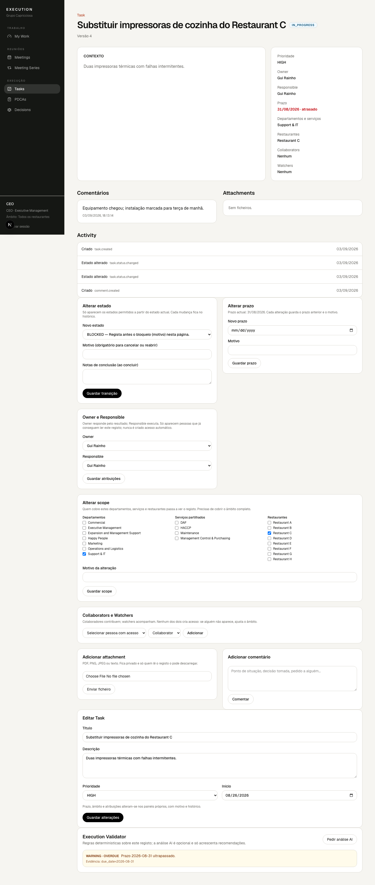
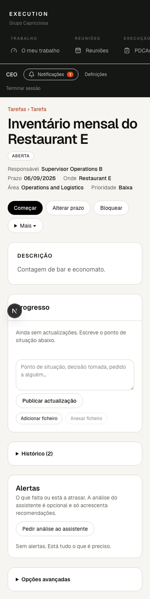
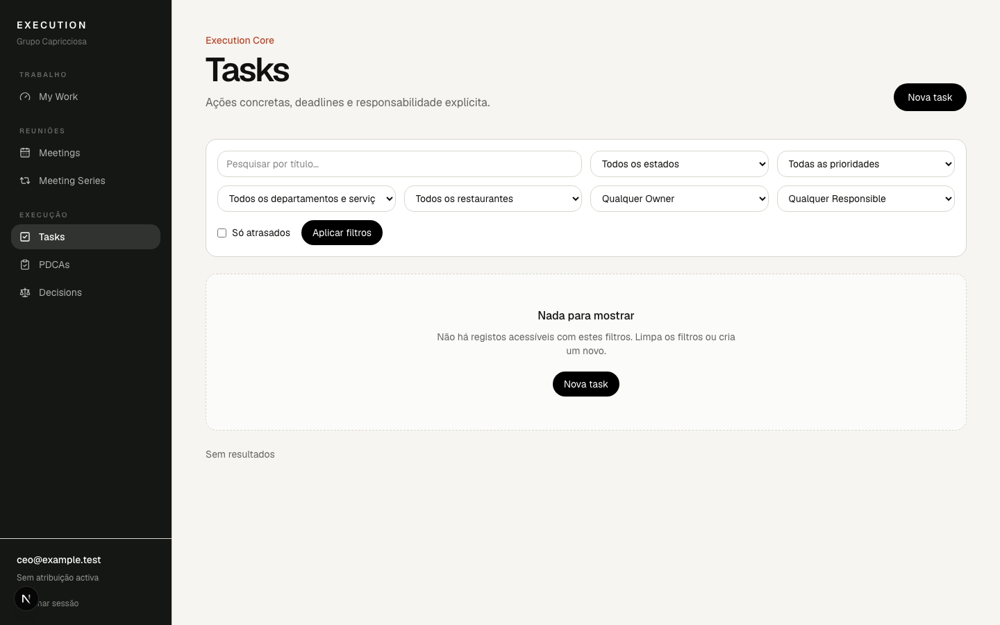

# 3. Tarefas

Uma tarefa é uma acção concreta: tem um título, um Responsável, normalmente um
prazo, e diz onde se aplica.

## Criar uma tarefa

Em **Tarefas › Nova tarefa** (ou dentro de uma reunião com **+ Tarefa**):

Campos:

- **O que é preciso fazer?** — o título. Escreve como o dirias em voz alta.
- **Responsável** — obrigatório. Só aparecem pessoas com acesso ao assunto.
- **Prazo** — recomendado. Sem prazo a tarefa fica com o aviso «Sem prazo».
- **Onde se aplica?** — escolhe os restaurantes. Por omissão fica o contexto
  (a reunião ou os restaurantes que cobres); podes escolher um restaurante, todos
  os que cobres ou uma combinação. O resumo «Aplica-se a: …» mostra sempre o
  âmbito final antes de gravar.
- **Opções avançadas** — Owner, prioridade, descrição, área e visibilidade.

## A página da tarefa

De cima para baixo: título e estado; Responsável, prazo e onde se aplica;
alertas em âmbar quando falta algo; os botões de acção; a descrição; o
progresso (actualizações e ficheiros); o histórico; e as opções avançadas.

Os botões são verbos, não estados:

| Botão            | O que faz                                                 |
| ---------------- | --------------------------------------------------------- |
| Activar          | Tira a tarefa de rascunho (precisa de Responsável).       |
| Começar          | Marca que está em curso.                                  |
| Marcar concluída | Abre um painel para escreveres o resultado e concluir.    |
| Alterar prazo    | Novo prazo e motivo; fica no histórico.                   |
| Bloquear         | Regista o que está a impedir; a tarefa fica «Bloqueada».  |
| Desbloquear      | Fecha o bloqueio e retoma.                                |
| Mais ▾           | Reabrir, cancelar e outras transições, sempre com motivo. |

Nas **Opções avançadas** mudas Owner e Responsável, o âmbito, os colaboradores e
seguidores e o texto da tarefa.

## Lista de tarefas

Filtros essenciais à vista: pesquisa, estado, restaurante, responsável e «Só
atrasados». Em «Mais filtros» tens Owner, prioridade e área.

Cada filtro aceita **várias escolhas**: abre o selector, marca o que queres
(o botão passa a mostrar «Estado · 2») e carrega em **Filtrar**. As escolhas
aplicadas aparecem como etiquetas por baixo dos filtros; o × de cada uma
retira só essa escolha e «Limpar filtros» retira todas.

**Ordenar**: carrega no cabeçalho de uma coluna (Tarefa, Responsável, Prazo,
Estado). O primeiro clique ordena de forma ascendente, o segundo inverte; a
seta ▲/▼ mostra a ordem activa. A ordem fica no endereço, por isso sobrevive
aos filtros, à paginação e a um link partilhado. Sem ordem escolhida, a lista
mostra primeiro o que foi actualizado há menos tempo.
