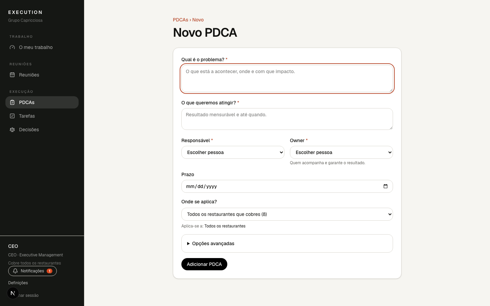
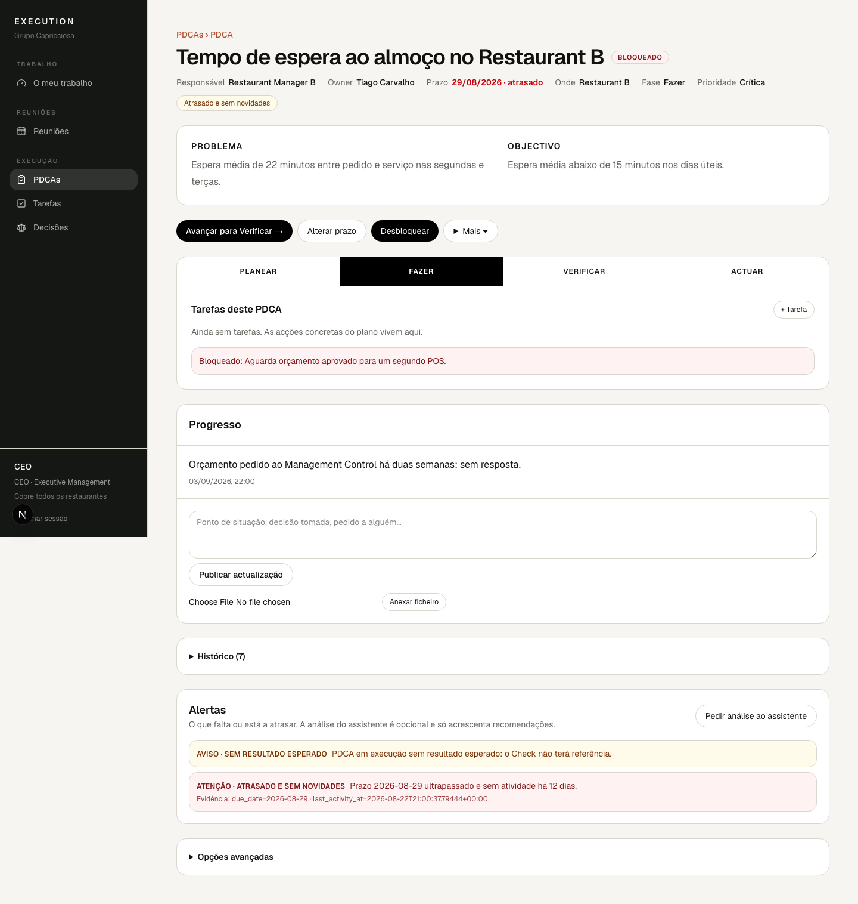

# 4. PDCAs

Um PDCA é um problema que se resolve por fases: **Planear**, **Fazer**,
**Verificar**, **Actuar**. Usa-o quando não chega uma tarefa.

## Criar um PDCA

Em **PDCAs › Novo PDCA** ou dentro de uma reunião com **+ PDCA**:

Obrigatório: **Qual é o problema?**, **O que queremos atingir?**,
**Responsável** e **Owner**. O título é derivado da primeira frase do problema
(podes mudá-lo nas opções avançadas). Prazo, causa raiz, resultado esperado,
prioridade, impacto e risco são opcionais e geram avisos quando faltam.

## A lista de PDCAs

Os filtros e a ordenação funcionam como nas tarefas (ver capítulo 3): cada
filtro aceita várias escolhas, as escolhas aparecem como etiquetas e os
cabeçalhos PDCA, Responsável, Fase, Prazo e Estado ordenam a lista.

Ao carregar num PDCA abre-se um **painel à direita** com o resumo: estado e
fase, Responsável, Owner, prazo, onde se aplica, o problema e o objectivo, as
três últimas actualizações e os botões de acção (avançar de fase, concluir,
alterar prazo, bloquear). Podes publicar uma actualização sem sair da lista.
A lista atrás mantém os filtros, a ordem e a página; **Fechar**, a tecla Esc
ou o botão Anterior do browser fecham o painel. O link do painel pode ser
partilhado: quem o abrir vê a mesma lista com o mesmo PDCA aberto.

**Abrir página completa** leva à página do PDCA (fases, tarefas, histórico,
alertas e opções avançadas); o link «PDCAs» no topo dessa página volta à lista
tal como a deixaste.

## A página do PDCA

O topo mostra Responsável, Owner, prazo, onde se aplica e a fase. Logo abaixo,
o **Problema** e o **Objectivo**, sempre visíveis.

Os separadores **Planear / Fazer / Verificar / Actuar** mostram só os campos da
fase escolhida:

- **Planear**: problema, objectivo, causa raiz ou hipótese, resultado esperado.
- **Fazer**: as tarefas deste PDCA e o botão **+ Tarefa**; um bloqueio activo
  aparece aqui.
- **Verificar**: resultado real e notas de verificação.
- **Actuar**: acção correctiva e standardização/resultado.

O botão **Avançar para …** muda de fase. A fase actual está sublinhada quando
estás a ver outra. Concluir um PDCA só é possível na fase Actuar.
