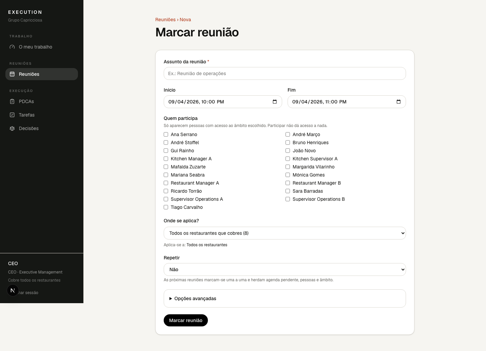
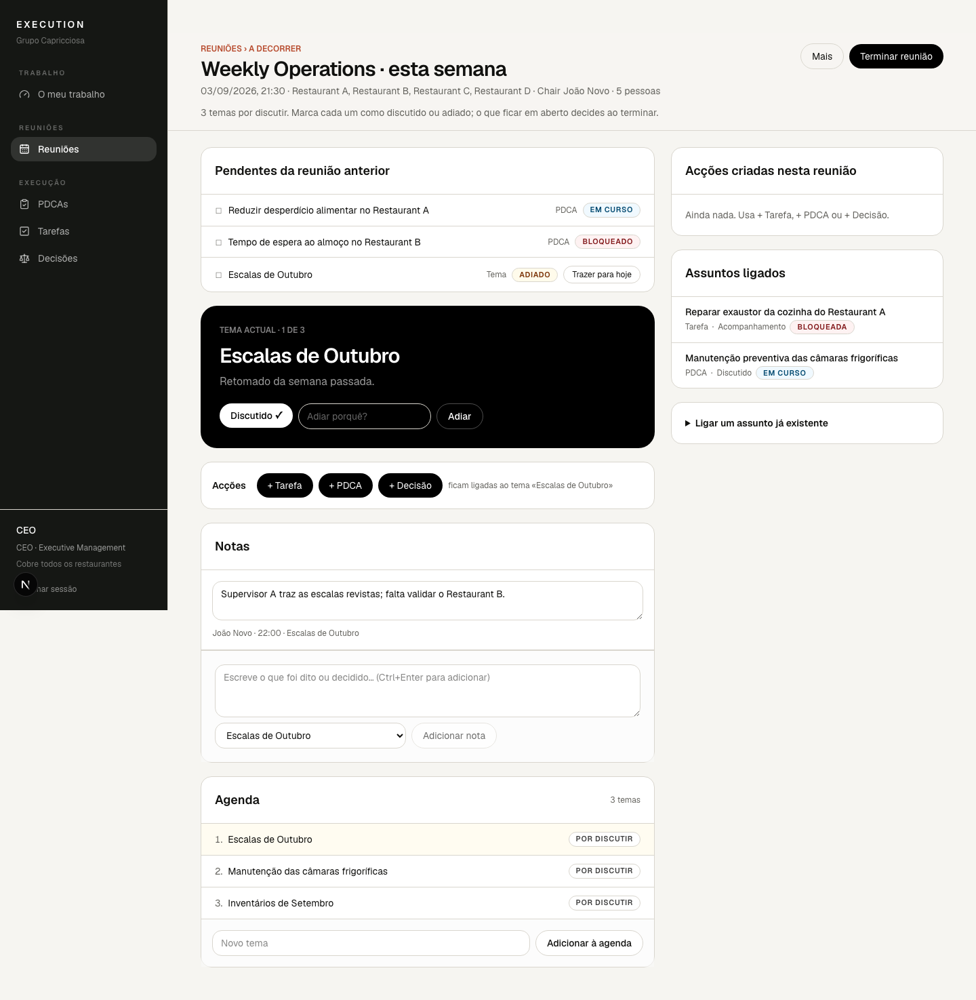
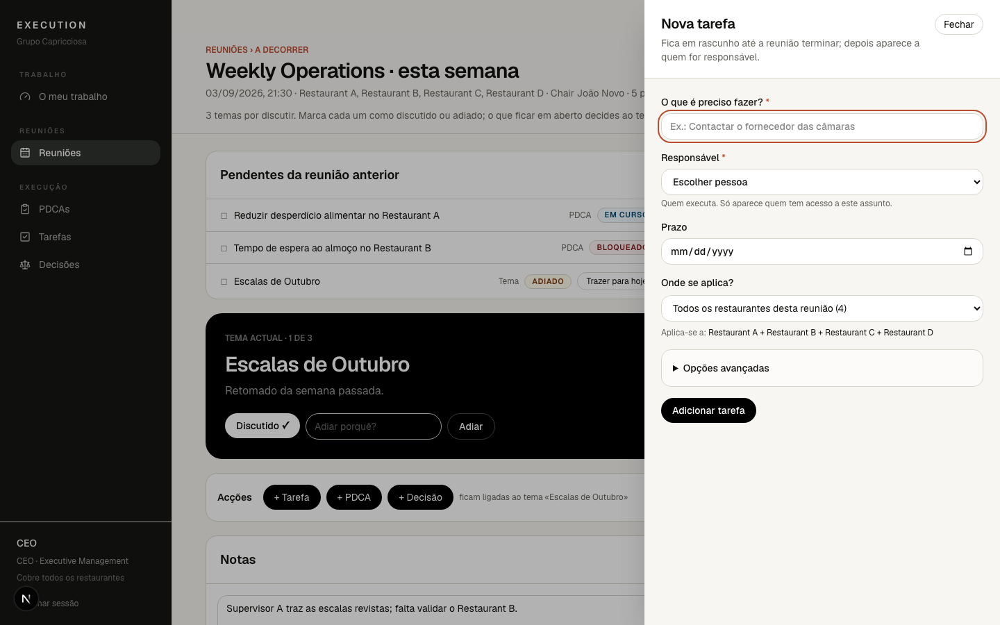
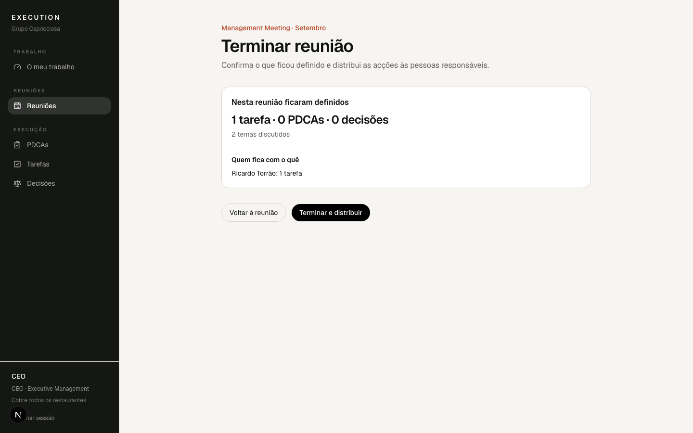
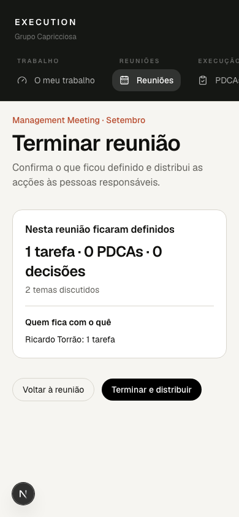

# 5. Reuniões

## Marcar uma reunião

Em **Reuniões › Marcar reunião**:

Dá um assunto, escolhe início e fim, quem participa, onde se aplica e se se
repete (semanal, quinzenal, mensal). Ao gravar entras logo na reunião.

## A reunião

Tudo acontece num ecrã:

- **Abrir reunião** quando começa. Não precisas de gerir estados.
- **Pendentes da reunião anterior** — temas adiados e assuntos abertos da última
  reunião da série. **Trazer para hoje** coloca um tema na agenda de hoje.
- **Tema actual** — o próximo tema por discutir, com **Discutido ✓** e
  **Adiar** (com motivo).
- **Acções** — **+ Tarefa**, **+ PDCA**, **+ Decisão** abrem um painel lateral;
  o que criares fica ligado ao tema actual e em rascunho até a reunião terminar.
- **Notas** — escreve e guarda sozinho («A guardar… / Guardado»). Se outra
  pessoa alterar a mesma nota aparece «Conflito — rever» e nada se perde.
- **Agenda** — a ordem dos temas e **Adicionar à agenda**.
- À direita, **Acções criadas nesta reunião** (a vermelho o que ainda não tem
  responsável) e **Assuntos ligados**.

**Mais** leva à página da reunião: participantes, Chair, repetição, assistente e
opções avançadas.

## Terminar e distribuir

**Terminar reunião** mostra o resumo: quantas tarefas, PDCAs e decisões, e quem
fica com o quê. Depois:

1. **Precisa de correcção antes de distribuir** — bloqueios (acção sem
   responsável, PDCA sem Owner, problema ou objectivo, pessoa sem acesso). O
   botão fica desactivado até corrigires; **Corrigir** leva ao registo e
   **Voltar a Terminar reunião** traz-te de volta.
2. **Temas sem conclusão** — para cada tema por discutir escolhes **Levar para
   a próxima reunião** ou **Dar como discutido**. Nada é adiado sem escolheres.
3. **Recomendado** — avisos (sem prazo, sem KPI, sem causa raiz). Não bloqueiam.

**Terminar e distribuir** faz tudo de uma vez: aplica as escolhas da agenda,
activa as acções e fecha a reunião. Se algo falhar, nada fica a meio. As acções
passam a aparecer em **O meu trabalho** de quem as executa.

