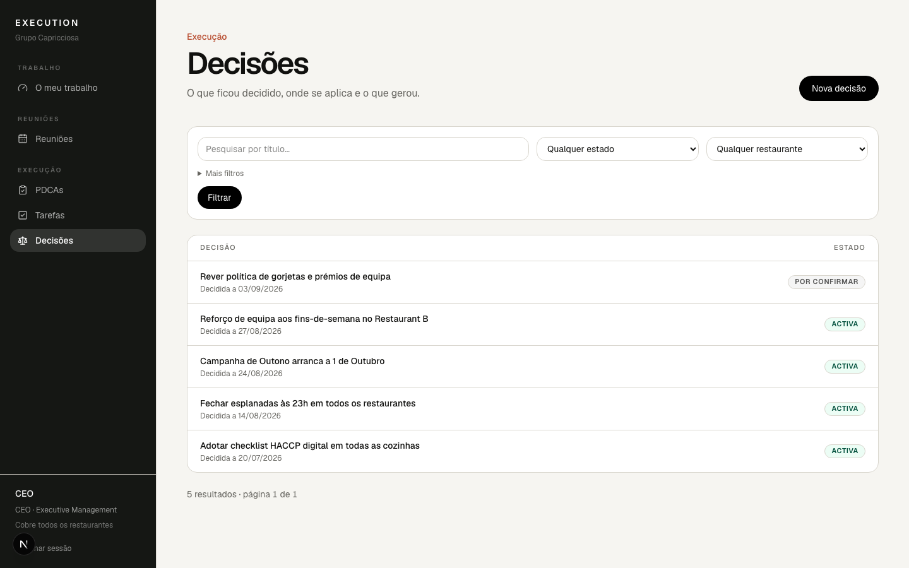

# 6. Decisões

Uma decisão é o que ficou decidido, com data e onde se aplica.

Cria em **Decisões › Nova decisão** ou numa reunião com **+ Decisão**. Só
precisas de escrever **O que ficou decidido?** e confirmar onde se aplica; a
data é hoje por omissão. A página da decisão mostra a reunião de origem, as
tarefas e PDCAs que gerou e permite criar uma tarefa a partir dela.
