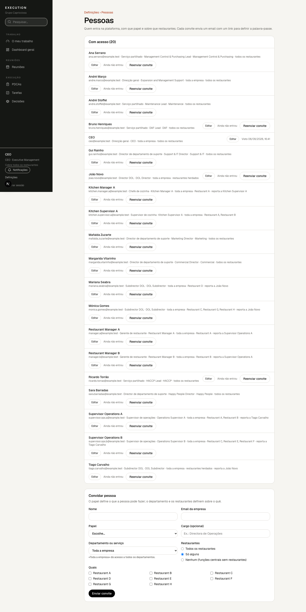
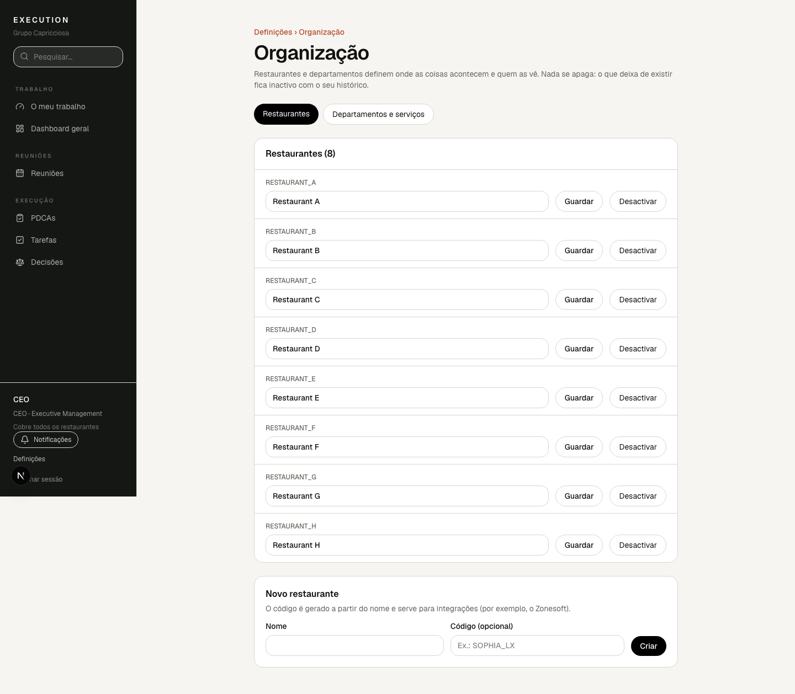

# 7. Quem vê o quê

Vês um assunto quando a tua função cobre os restaurantes e a área onde ele se
aplica. Não há listas de partilha para gerir.

- **Normal** — quem cobre o âmbito vê. É o caso quase sempre.
- **Restrita** — para assuntos sensíveis. Vê quem cobre o âmbito **e** tem
  permissão para assuntos restritos. **Quem criou o assunto continua a vê-lo**
  enquanto a sua função cobrir esse âmbito.
- **Privada** — só quem criou, mais quem receber acesso explícito.

Ser Responsável ou Owner não dá acesso por si só: se a pessoa não cobre o
âmbito, a aplicação avisa e pede para corrigir o âmbito ou a pessoa. Nunca cria
acessos escondidos.

Se deixares de cobrir um restaurante, deixas de ver os assuntos desse
restaurante, incluindo os que criaste com visibilidade restrita.

## O teu nome

Em **Definições › O teu nome** mudas como apareces nas listas, reuniões e
notificações. O email de entrada só quem gere a organização o muda.

## Convidar pessoas

Quem gere a organização vê em **Definições › Pessoas** quem tem acesso, com
que papel, departamento e restaurantes, e se a pessoa já entrou.

Para convidar alguém: nome, email da empresa, **papel** (o que pode fazer),
**departamento ou serviço** (ou «Toda a empresa») e **restaurantes** (todos,
só alguns ou nenhum). Ao enviar, a pessoa recebe um email com um link para
definir a palavra-passe. Enquanto não entrar, aparece «Ainda não entrou» e o
botão **Reenviar convite**; depois de entrar aparece «Visto» com a data.

O papel e o âmbito escolhidos aqui são a única coisa que define o que a pessoa
vê: não há permissões avulsas por registo (excepto os acessos explícitos
descritos acima).

## Editar, desactivar e organizar

Em **Definições › Pessoas**, o botão **Editar** de cada pessoa abre um painel
com os **dados da pessoa** (nome e email; mudar o email muda o login) e, por
baixo, o papel, o cargo, o departamento, os departamentos que vê (todos ou
só o seu), os restaurantes (todos, só alguns, os das pessoas que lhe reportam,
ou nenhum) e **Reporta a**. Quem está acima na cadeia de chefia cobre os
restaurantes de quem está abaixo quando tem «Os das pessoas que lhe reportam».
**Desactivar acesso** termina as atribuições e bloqueia a entrada; o histórico
mantém-se e ninguém pode desactivar-se a si próprio.

Em **Definições › Organização** criam-se, renomeiam-se e desactivam-se
restaurantes, departamentos e serviços partilhados. Nada se apaga: o que deixa
de existir fica inactivo e sai das escolhas, mas os registos antigos continuam
a apontar para ele. O código de um restaurante (por exemplo `SOPHIA_LX`) é
gerado a partir do nome e serve para integrações.

Papéis e permissões não se editam na aplicação de propósito: mudam o que toda
a gente vê e são revistos no código.
