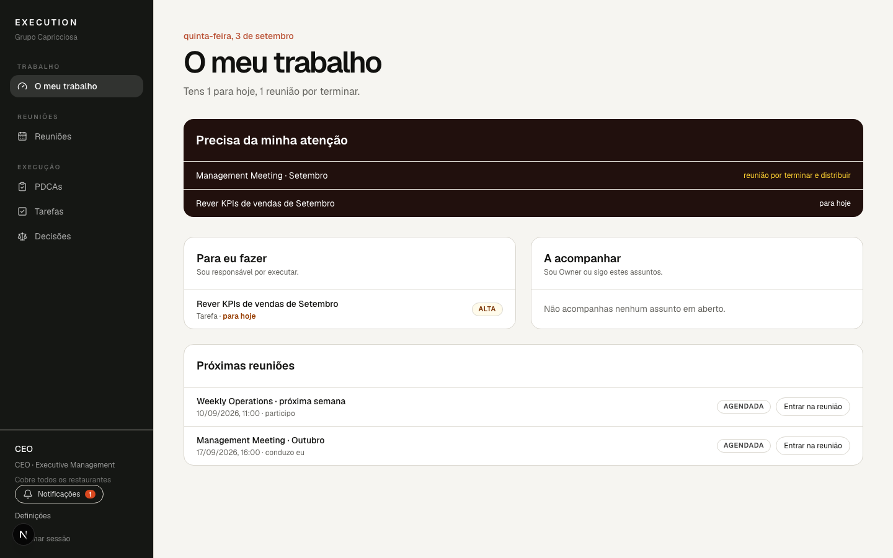
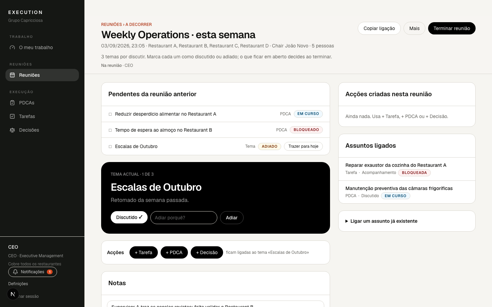

# 10. Participar numa reunião

## Encontrar as minhas reuniões

Em **O meu trabalho › Próximas reuniões** aparecem as reuniões em que
participas ou conduzes, com a data e um botão **Entrar na reunião**. Uma
reunião a decorrer mostra «● A decorrer agora»; uma que está quase a começar
mostra «Começa em breve». Também recebes uma notificação quando te adicionam a
uma reunião e um lembrete 30 minutos antes.

## Entrar

Carrega em **Entrar na reunião** ou abre a ligação que te enviaram (por
Teams, WhatsApp ou email). Se ainda não tiveres sessão iniciada, entras primeiro
e a aplicação leva-te directamente à reunião. A ligação só te leva lá: quem não
tem acesso à reunião vê apenas «Não tens acesso a este conteúdo».

## Quem está na reunião

Por baixo do título aparece **Na reunião · Ana · Gui · Mafalda**: as pessoas
que têm a reunião aberta neste momento.

## Chair e participantes

- O **Chair** conduz: abre a reunião, gere a agenda, marca temas como
  discutidos ou adiados, corrige bloqueios e faz **Terminar e distribuir**.
- Um **participante** acompanha a agenda e os pendentes a que tem acesso,
  escreve notas, cria tarefas, PDCAs e decisões, e consulta as acções criadas.

Participar numa reunião não dá acesso a nada que não vias antes. Duas pessoas
na mesma reunião podem ver listas diferentes: um assunto privado ligado à
reunião só aparece a quem tem acesso a ele.

## Criar uma Tarefa, um PDCA ou uma Decisão

Usa os botões **+ Tarefa**, **+ PDCA** e **+ Decisão**. O painel abre ao lado,
sem sair da reunião; a acção fica ligada ao tema actual e em rascunho até a
reunião terminar. Ver os capítulos 3, 4 e 6 para os campos.

## Alterações em tempo real

Quando a Mafalda cria uma tarefa, ela aparece no ecrã do Gui sem recarregar.
Agenda, temas discutidos, participantes, assuntos ligados e acções criadas
actualizam-se para todos. Se a ligação cair, aparece «Sem ligação em tempo
real — a tentar ligar…» e, mal volte, o ecrã põe-se em dia sozinho.

## Duas pessoas a alterar a mesma informação

Cada nota pertence a quem a escreveu, por isso a única forma de conflito é a
mesma pessoa em dois dispositivos. Nesse caso o editor avisa «Versão mais
recente — rever», mostra o texto mais recente por baixo do teu e deixa-te
escolher **Usar a versão mais recente** ou **Manter o meu texto**. Nada é
substituído às escondidas. Para a agenda e as acções, a última alteração
gravada é a que fica, e todos a vêem.

## Terminar a reunião (Chair)

**Terminar reunião** mostra o resumo, os bloqueios a corrigir e os temas sem
conclusão; **Terminar e distribuir** activa as acções e avisa cada responsável.
Ver o capítulo 5.
