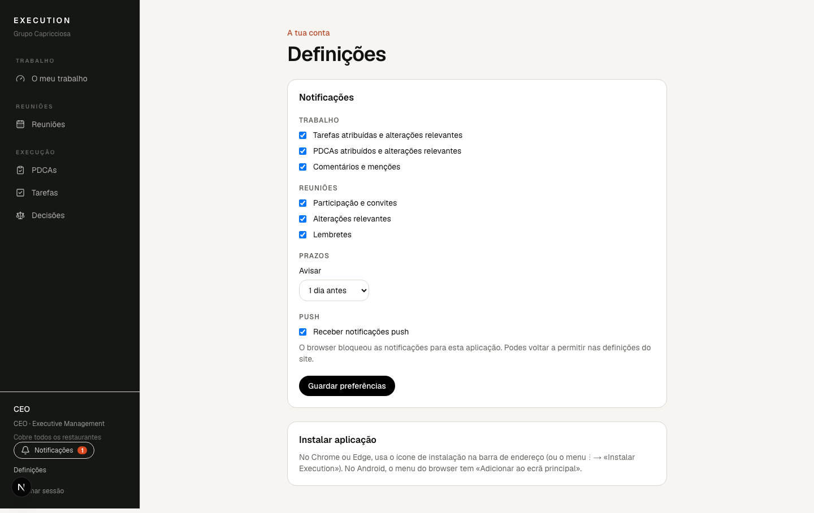

# 11. Instalar a aplicação

A aplicação instala-se como qualquer app: ícone próprio, janela própria e
notificações. Não guarda dados no dispositivo; sem ligação mostra «Sem ligação
à Internet» em vez de informação desactualizada.

Em **Definições › Instalar aplicação** vês as instruções certas para o teu
dispositivo.

## Computador (Chrome ou Edge)

1. Abre a aplicação no browser.
2. Em **Definições**, carrega em **Instalar aplicação** (ou usa o ícone de
   instalação na barra de endereço).
3. Confirma. A aplicação abre numa janela própria e fica no Launchpad / menu
   Iniciar.

## iPhone e iPad

1. Abre a aplicação no **Safari**.
2. Toca em **Partilhar** (o quadrado com a seta para cima).
3. Escolhe **Adicionar ao ecrã principal** e confirma.

As notificações push no iPhone só funcionam depois deste passo (iOS 16.4 ou
superior).

## Android

1. Abre a aplicação no Chrome.
2. Aceita o pedido «Instalar aplicação» ou usa o menu ⋮ → **Adicionar ao ecrã
   principal**.

## Actualizações

Quando existe uma versão nova aparece discretamente «Nova versão disponível —
Actualizar». Podes actualizar na hora ou na próxima abertura.
