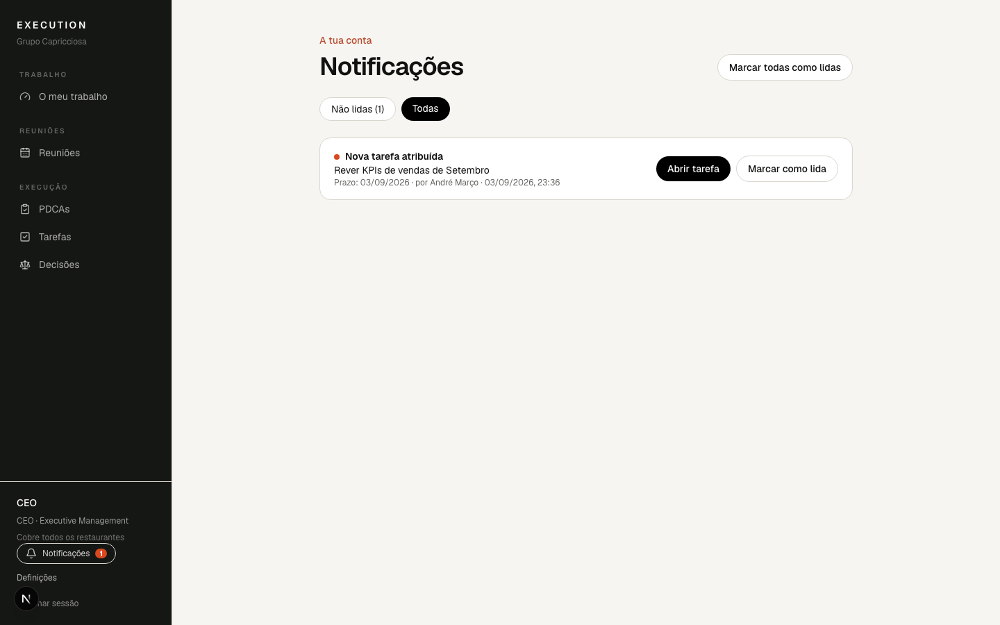

# 12. Notificações

## Centro de Notificações

O sino na barra lateral mostra quantas notificações tens por ler. Abre
**Notificações**: o separador **Não lidas** tem o que precisa de ti; **Todas**
mostra o histórico. Cada entrada diz o que aconteceu, o assunto, quando, e tem
um botão para abrir directamente a tarefa, o PDCA, a reunião ou a decisão.
Abrir marca como lida; também podes **Marcar como lida** ou **Marcar todas
como lidas**.

## O que te avisa

- **Tarefas**: atribuídas a ti, prazo alterado, bloqueadas, concluídas (se és
  Owner), reabertas.
- **PDCAs**: atribuídos como Responsável ou Owner, bloqueios, mudança de fase,
  prazo alterado.
- **Reuniões**: quando te adicionam, quando a reunião muda ou começa, quando
  está à espera da tua validação (Chair), e um lembrete 30 minutos antes.
- **Colaboração**: quando te mencionam (@Nome) ou comentam numa tarefa/PDCA
  tua.
- **Prazos**: 1 ou 2 dias antes, e quando algo fica em atraso.

Não recebes notificações do que fazes tu próprio, nem de cada pequena
alteração: várias mudanças seguidas no mesmo assunto ficam numa só entrada até
a leres.

## Preferências

Em **Definições › Notificações** ligas e desligas cada grupo e escolhes quando
avisar sobre prazos. São poucas opções de propósito.

## Notificações push (no dispositivo)

Para receber avisos mesmo com a aplicação fechada:

1. Em **Definições › Push**, carrega em **Receber neste dispositivo**.
2. Aceita o pedido do browser.

Podes activar em vários dispositivos (portátil, telemóvel, outro browser) e ver
a lista em Definições, com **Remover** para cada um. **Desactivar neste
dispositivo** desliga só este. Dispositivos que deixam de existir são
limpos automaticamente. Num computador partilhado, remove o teu dispositivo
antes de o entregar.

## Privacidade no ecrã bloqueado

Para assuntos normais o aviso mostra o título («Nova tarefa atribuída — Rever
proposta de servidores · Prazo: amanhã»). Para assuntos **reservados ou
privados** o aviso diz apenas «Assunto reservado — Tem uma nova actualização
num assunto reservado». O conteúdo só aparece depois de abrires a aplicação e
de o acesso ser confirmado. Tocar numa notificação nunca dá acesso a nada: se
entretanto perdeste acesso, vês «Não tens acesso a este conteúdo».
